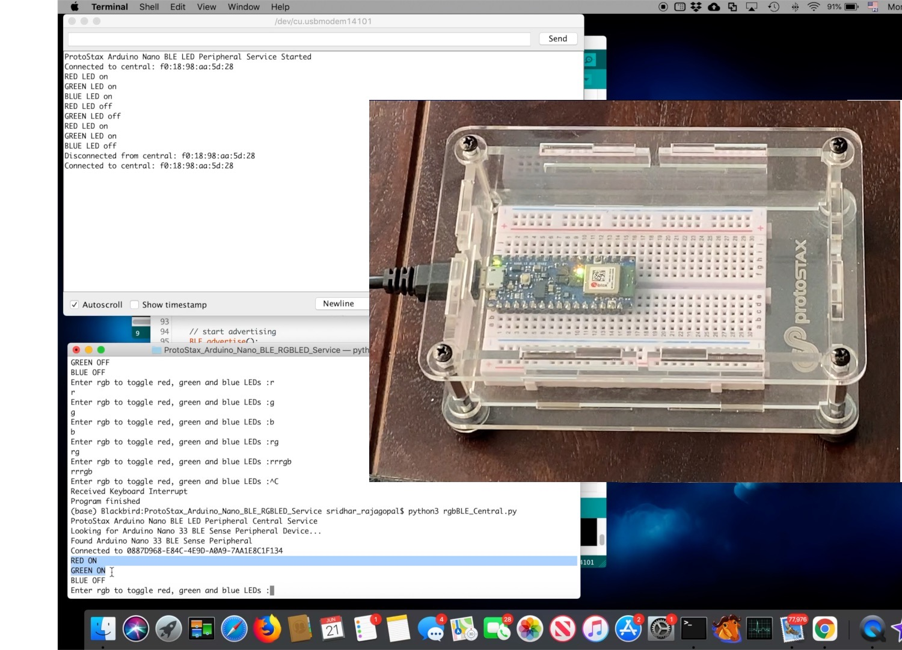

# ProtoStax_Arduino_Nano_BLE_RGBLED_Service

Demo for ProtoStax Arduino Nano BLE RGB LED Service - control the RGB
LED on your Arduino Nano BLE Sense using Python from your PC (Windows,
Mac, Linux, Raspberry Pi) that has Bluetooth



using

* Arduino Nano 33 BLE Sense 
 *
   [ProtoStax for Breadboard/Custom Boards](https://www.protostax.com/collections/all/products/protostax-for-breadboard)
   Enclosure to house and protect the Nano and other circuitry you
   might/can add
* A PC (Windows, Mac, Linux, Raspberry Pi) with Bluetooth support and Python

For further instructions, see the [Portable Capacitive Touch Piano](https://www.hackster.io/sridhar-rajagopal/protostax-capacitive-touch-piano-demo-2c38e9) Tutorial at [Hackster.io](https://www.hackster.io/sridhar-rajagopal/protostax-capacitive-touch-piano-demo-2c38e9)


## Prerequisites

Set up the Arduino Nano to use with your Arduino IDE - see [Getting started with the Arduino Nano 33 BLE Sense
](https://www.arduino.cc/en/Guide/NANO33BLESense)

Install ArduinoBLE Library using the Library Manager in your Arduino
IDE

On your PC, you will need
* Python 3
* install necessary python packages

```
pip3 install bleak
 
```


## Installing

```
git clone https://github.com/protostax/ProtoStax_Arduino_Nano_BLE_RGBLED_Service.git
```

or download from GitHub as a zip file and unzip it. 

## Usage

See additional instructions and details in Tutorial linked above 

```
cd ProtoStax_Arduino_Nano_BLE_RGBLED_Service
open
ProtoStax_Arduino_Nano_BLE_RGB_Peripheral/ProtoStax_Arduino_Nano_BLE_RGB_Peripheral.ino in
Arduino IDE
compile sketch and upload to your Arduino Nano 33 BLE Sense
```

```
On your PC (Windows, Mac, Linux (including Raspberry Pi) with
Bluetooth support

cd ProtoStax_Arduino_Nano_BLE_RGBLED_Service
python3 rgbLED_Central.py
```


## License

Written by Sridhar Rajagopal for ProtoStax. BSD license, all text above must be included in any redistribution

A lot of time and effort has gone into providing this and other code. Please support ProtoStax by purchasing products from us!


